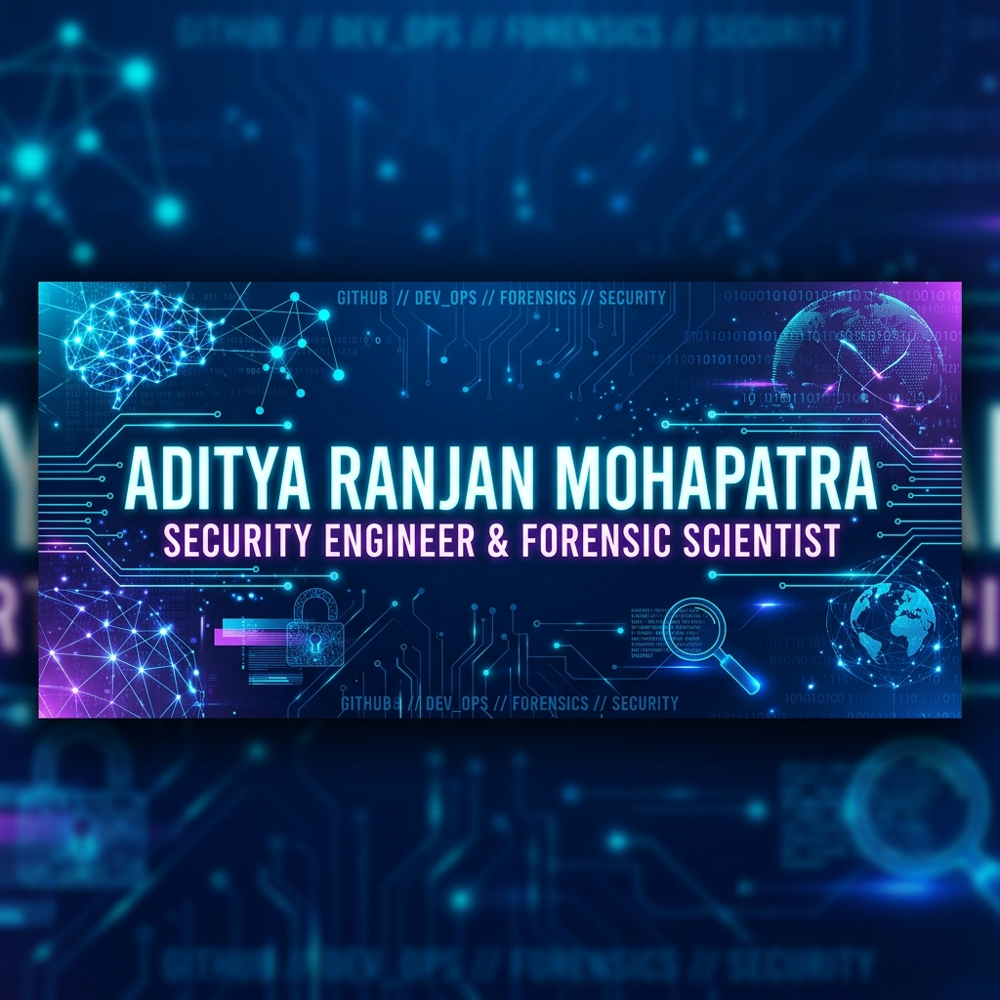

# Hey there! I'm Aditya Ranjan Mohapatra 👋

  

  
  

  
  

---

## ⚡ Quick Profile

> 🛡️ **Investigator by Education, Defender by Profession.**
> I bridge traditional physical sciences with modern cybersecurity. As a Security Engineer, I deploy and automate CrowdStrike Falcon across enterprise environments while using a forensic mindset to dissect threat paths and alert telemetry.

---

### 💼 Professional Journey

#### 🔹 Security Engineer L1 — ITPeopleNetwork (ITPN Consulting)
*May 2026 - Present*
*   Specializing in enterprise endpoint security engineering.
*   Deploying, configuring, and managing CrowdStrike Falcon sensors across corporate networks.
*   Configuring prevention policies, onboarding new assets, executing migrations to the Falcon Console/Microsoft Intune, and designing robust detection engineering rules.

#### 🔹 Content Developer & Founding Board Member — Sure Clue Scientific Solutions
*Jan 2026 - Present*
*   Preparing academic content, study materials, and technical presentations in Forensic Science.
*   Researching toxicological profiles, questioned documents, and guiding forensic science educational courses.

#### 🔹 Trainee Security Engineer — ITPeopleNetwork
*Feb 2026 - Apr 2026*
*   Underwent hands-on training in security operations, endpoint protection, and platform essentials.
*   Maintained sensor configurations, debugged installation issues, configured policies, and validated security rules.

#### 🔹 Certified SOC Analyst Intern — CFSS Cyber & Forensics Security Solutions
*Jan 2026 - Feb 2026*
*   Trained in security operations center workflows.
*   Analyzed event logs, aligned alerts with the MITRE ATT&CK framework, correlated digital telemetry, and studied incident mitigation.

#### 🔹 Forensic Intern — Regional Forensic Science Laboratory Bilaspur
*Jun 2025 - Jun 2025*
*   Supported the scientific officer in the Toxicology and Biology divisions.
*   Handled forensic documentation, collected evidence, maintained strict chain of custody, and analyzed toxicological samples in crime investigations.

#### 🔹 SOC Trainee & Intern — Cache Digital Solutions Pvt. Ltd.
*Jun 2024 - Mar 2025*
*   Trained in SIEM management, log correlation, real-time alert triage, and incident response.
*   Monitored network traffic events, created dashboards, and documented threat vectors.

#### 🔹 Lecturer (Teaching Faculty) — Indtech Educational and Technical Institute
*Aug 2023 - Jan 2024*
*   Educated students on occupational safety, fire protection, and risk assessment (NFPA, OSHA, ISO 45001, and ISO 14001 compliance).
*   Developed case studies on industrial accident root-cause analysis and led practical workshops on hazardous material handling.

---

### 🚀 Featured Projects

#### 🤖 [AI SOC Copilot for CrowdStrike](https://github.com/mohapatraaditya17-crypto)
*   **Description**: Integrates Large Language Models (LLMs) with the CrowdStrike Falcon Platform via FalconPy to automate security workflows, enabling natural language endpoint queries, threat triage, and automated reporting.
*   **Stack**: `Python`, `LLMs / RAG`, `CrowdStrike API`, `FalconPy`

#### ⚙️ [CrowdStrike API Operations Suite](https://github.com/mohapatraaditya17-crypto)
*   **Description**: Programmatic cybersecurity operations tool using the CrowdStrike API and FalconPy SDK. Tracks prevention policy drift, reduced functionality mode (RFM) sensors, and logs RBAC compliance.
*   **Stack**: `Python`, `FalconPy`, `Pandas`, `OAuth2 API`

#### 🛡️ [Device Control & Prevention Policy Testing](https://github.com/mohapatraaditya17-crypto)
*   **Description**: Controlled testing and validation of EDR policies, device controls (USB blocking), malware execution containment, and host isolations.
*   **Stack**: `EDR Testing`, `Device Control`, `Prevention Policies`, `Win Security`

#### 🧪 [Environmental Forensic Assessment of Water Quality](https://github.com/mohapatraaditya17-crypto)
*   **Description**: Environmental forensic investigation evaluating heavy metal (Chromium, Nickel) contamination and physicochemical profiles in drinking water at Bilaspur Station using Atomic Absorption Spectroscopy (AAS).
*   **Stack**: `Forensics`, `Atomic Spectroscopy`, `Toxicology`, `APHA Standards`

#### 🧠 [Automatic Malware Detection with LSTM](https://github.com/mohapatraaditya17-crypto)
*   **Description**: A deep learning (LSTM) and machine learning research project analyzing algorithmic polymorphic malware detection, adversarial evasion, and Explainable AI (XAI) models.
*   **Stack**: `Machine Learning`, `Deep Learning`, `LSTM Networks`, `Malware Analysis`

---

### 🎓 Education

*   **M.Sc. in Forensic Science** — *Guru Ghasidas Vishwavidyalaya, Bilaspur* (2024 - 2026)
    *   Focus: Questioned Documents, Forensic Biology/Serology, and Chemical Toxicology.
    *   **UGC NET Qualified** (June 2025) in Forensic Sciences.
*   **B.Sc. in Forensic Science** — *Centurion University of Technology and Management* (2020 - 2023)

---

### 🏆 Certifications & Credentials

<b>Click to expand the full list of 22+ professional credentials</b>

 

#### 🛡️ CrowdStrike Falcon Platform
*   **FALCON 100: Falcon Platform Architecture Overview** — *CrowdStrike University* (ID: C648037)
*   **FALCON 101: Falcon Platform Essentials** — *CrowdStrike University* (ID: C648053)
*   **FALCON 102: Falcon Platform Onboarding Configuration** — *CrowdStrike University* (ID: C648136)
*   **FALCON 104: Getting Started with Endpoint Security** — *CrowdStrike University* (ID: C648160)
*   **FALCON 105: Sensor Installation, Configuration and Troubleshooting** — *CrowdStrike University* (ID: C648202)
*   **FALCON 106: Customizing Dashboards in Falcon** — *CrowdStrike University* (ID: C648253)
*   **FALCON 107: Falcon Firewall Management Fundamentals** — *CrowdStrike University* (ID: C648266)
*   **Falcon Fusion SOAR Fundamentals (SOAR 100)** — *CrowdStrike University*
*   **FALCON 160: Falcon for Mobile** — *CrowdStrike University* (ID: C648289)
*   **ITSEC 121: Vulnerability Management Fundamentals** — *CrowdStrike University* (ID: C648351)
*   **ITSEC 122: Asset Management Fundamentals** — *CrowdStrike University* (ID: C648358)

#### 💻 Cybersecurity & IT
*   **ISC2 Candidate** — *ISC2* (ID: ISC2-Candidate)
*   **Fortinet Certified Fundamentals** — *Fortinet* (ID: 6944259184AR)
*   **Introduction to the Threat Landscape 3.0** — *Fortinet*
*   **Getting Started in Cybersecurity 3.0** — *Fortinet*
*   **Introduction to Cybersecurity** — *Cisco*
*   **Introduction to Cybersecurity** — *Cisco Networking Academy* (ID: e0fd0b51-600f-48ce-98ea-00f089608bf8)
*   **AI in Cybersecurity: Vulnerability, Intelligence, Security, and Ethics** — *Alison* (ID: 7359-42402669)
*   **Internship Common Aptitude Test** — *Internship Studio* (ID: CIT-P-2812367)

#### 🧪 Forensic Science & Safety
*   **Diploma in Digital Forensic Investigation** — *Alison* (ID: 4795-42402669)
*   **Four - Legged detectives: The Mastery of Cadaver Dogs** — *C.A.S.E. 23 OFFICIAL* (ID: CASE/GL-12/08)
*   **Diploma in Fire Safety** — *Alison* (ID: 6071-42402669)
*   **EHS Guidelines - Environment, Health and Safety** — *Alison* (ID: 5382-42402669)
*   **Food Safety and Hygiene in the Catering Industry** — *Alison* (ID: 1363-42402669)

---

### 🛠️ Daily Toolkit

| Layer | Tools & Technologies |
| :--- | :--- |
| **Endpoint Security** | `CrowdStrike Falcon` `EDR/XDR` `Microsoft Intune` `Microsoft Entra ID` |
| **Investigative Sciences** | `Digital Forensics` `Forensic Medicine & Toxicology` `Crime Scene Investigation` |
| **Automation & Scripting** | `Python` `PowerShell` `FalconPy (SDK)` `REST APIs` `Generative AI & LLMs` |
| **SIEM & Operations** | `Splunk` `Azure Sentinel` `ServiceNow` `SOC2/ISO Compliance` |

---

### 📈 GitHub Stats & Analytics

  
  

  

---

### 💼 Get In Touch

*   **LinkedIn**: Connect with me on [LinkedIn](https://in.linkedin.com/in/aditya-ranjan-mohapatra).
*   **Email**: Reach out to me at [mohapatraaditya17@gmail.com](mailto:mohapatraaditya17@gmail.com) for projects, collaborations, or opportunities.
*   **Portfolio Website**: Check out my full interactive portfolio website hosted on [GitHub Pages](https://mohapatraaditya17-crypto.github.io/aditya-ranjan-mohapatra-portfolio/).

<!-- LinkedIn Profile Badge Widget -->

  
<a class="badge-base__link LI-simple-link" href="https://in.linkedin.com/in/aditya-ranjan-mohapatra?trk=profile-badge">Aditya Ranjan Mohapatra</a>

